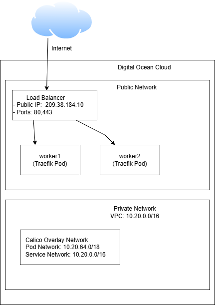

# Terraform инфраструктура для Digital Ocean
Этот репозиторий содержит модульную конфигурацию для развертывания облачной инфраструктуры. Состоит из 2 модулей: compute(для разворачивания droplet) и network (VPC и firewall)


## Требования
Перед началом работы нужно:
1. создать Spaces Object Storage для хранения state файлов
    - отредактировать файл backend.tf, указав имя bucket, ключ , регион , entrypoint
    - При создании workspace в bucket записывается state-файл для окружения
    ```bash
        terraform workspace new staging
        terraform workspace new prod
    ```

2. создать PAT для доступа к API Digital Ocean с правами read и write
3. ssh-ключ для прокидывания на droplet(vm) для разворачивания  k8s кластера

## Инициализация 
Инициализируйте Terraform и установите провайдеры:
 ```bash  
        terraform init
```

## Планирование и применение изменений
Для каждого окружения используйте свой файл переменных.
- Для окружения  production
```bash
terraform workspace select production
terraform plan -var-file=environments/production.tfvars 
terraform apply -var-file=environments/production.tfvars 
```
- Для окружения staging
```bash
terraform workspace select staging
terraform plan -var-file=environments/staging.tfvars 
terraform apply -var-file=environments/staging.tfvars 
```

# Развертывание Kubernetes кластера

Kubernetes кластер развернут с использованием Kubespray v2.29.0
## Подготовка Kubespray
```bash
    git clone https://github.com/kubernetes-sigs/kubespray.git
    cd kubespray
    git checkout v2.29.0
    pip install -r requirements.txt
```
## Создание inventory файла
```bash
cp -rfp inventory/sample inventory/k8s-cluster
```
Создайте файл inventory/k8s-cluster/hosts.yaml со следующей структурой:
```yaml
all:
  hosts:
    master:
      ansible_host: <MASTER_IP>
      ip: <MASTER_PRIVATE_IP>
      access_ip: <MATER_IP>
    worker1:
      ansible_host: <WORKER1_IP>
      ip: <WORKER1_PRIVATE_IP>
      access_ip: <WORKER1_IP>
    worker2:
      ansible_host: <WORKER2_IP>
      ip: <WORKER2_PRIVATE_IP>
      access_ip: <WORKER2_IP>
  children:
    kube_control_plane:
      hosts:
        master:
    kube_node:
      hosts:
        worker1:
        worker2:
    etcd:
      hosts:
        master:                      
    k8s_cluster:
      children:
        kube_control_plane:
        kube_node:
    calico_rr:
      hosts: {}
```
## Настройка конфигурации
Настройте следующие файлы в inventory/k8s-cluster/group_vars/:
- Файл all/all.yaml
```yaml
cloud_provider: external
external_cloud_provider: manual #kubespray не поддерживает DigitalOcean
persistent_volumes_enabled: true
```
- k8s-cluster/k8s-cluster.yaml
```yaml
kube_network_plugin: calico
kube_service_addresses: 10.20.0.0/16
kube_pods_subnet: 10.20.64.0/18
```
- k8s-cluster/addons.yaml
```yaml
helm_enabled: true
cert_manager_enabled: true
argocd_enabled: true
```
## Запуск развертывания
```bash
ansible-playbook -i inventory/k8s-cluster/hosts.yaml cluster.yml
```
## Установка Cloud Controler Manager
Сначала создаем secret c PAT DO
```bash
kubectl create secret digitalocean -n kube-system --from-literal=access-token=<YOUR_DIGITALOCEAN_TOKEN>
```
Устанавливаем через yaml манифест:
```bash
kubectl apply -f CCM/digitalocean-ccm.yaml
```
## Установка Ingress Controller(Traefik)
- Добавление Helm репозитория Traefik
```bash
helm repo add traefik https://traefik.github.io/charts
helm repo update
```
- Создание namespace traefik
```bash
kubectl create namespace traefik
```
- Установка traefik 
```bash
helm install traefik traefik/traefik -n traefik -f traefik/traefik.yaml
```
После установки traefik проверить создание LoadBalancer в облачном провайдере